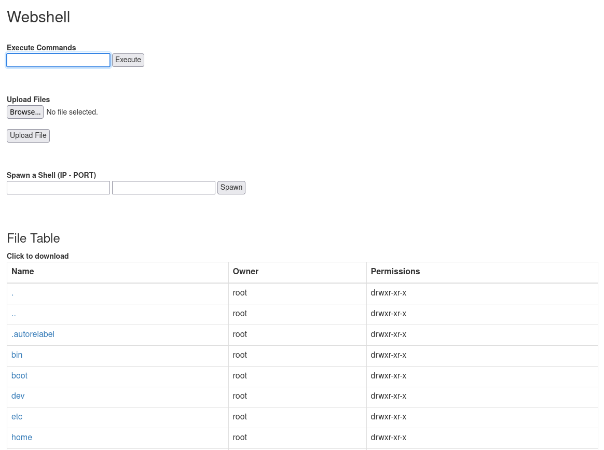

# Webshell

My PHP webshell comprised of lots of cool ideas from other shells.
Contains more features than a basic shell, but nothing I don't use more often than not. 

## Table of Contents

- [Installation](#installation)
- [Features](#features)
- [Usage](#usage)
- [Example](#example)

## Installation

Just clone the repo!

```bash
$ git clone https://github.com/duck-sec/webshell
```

## Features

Features include: 
- Cookie based authentication
- Masquerade as an Apache 404 for unauthorised users
- Upload / Download files
- Spawn a reverse shell (catch with netcat)
- Basic file table to make navigation easy

## Usage

Before "Installing" the shell on your target server, set a password at the top of the script:

```
#Set password value, which must be set in the cookie

$password = "password";
```

Ideally don't use "password"...
Pass your chosen password to the shell in a cookie named "auth" to gain access. 
Attempting to access the shell without this cookie will cause the shell to pretend to be an Apache not found page.


## Example

